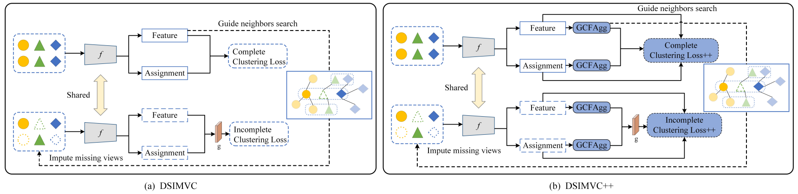

# DSIMVC++

## 1. Framework



The caparison of DSIMVC and DSIMVC++ framework for incomplete multi-view clustering. In DSIMVC++, the proposed
GCFAgg module is integrated to obtain the consensus representation and consensus clustering assignment, and the clustering loss is
enhanced by the proposed SgCL module.

## 2.Requirements

pytorch==1.12.1

numpy>=1.21.6

scikit-learn>=1.0.2

## 3.Datasets

The datasets are placed in "data" folder. The others dataset could be downloaded from [cloud](https://pan.baidu.com/s/1XNWW8UqTcPMkw9NpiKqvOQ). key: data

## 4.Usage

- Before run, please carefully read  ''Obtain-S.docx'', and refer to the steps inside it to modify the code in order to obtain S.

## 5.Experiment Results


## 6.Acknowledgments

Work&Code is inspired by [DSIMVC](https://github.com/Gasteinh/DSIMVC)

## 7.Citation

If you find our work useful in your research, please consider citing:

```latex
@InProceedings{Yan_2023_CVPR,
    author    = {Yan, Weiqing and Zhang, Yuanyang and Lv, Chenlei and Tang, Chang and Yue, Guanghui and Liao, Liang and Lin, Weisi},
    title     = {GCFAgg: Global and Cross-View Feature Aggregation for Multi-View Clustering},
    booktitle = {Proceedings of the IEEE/CVF Conference on Computer Vision and Pattern Recognition (CVPR)},
    month     = {June},
    year      = {2023},
    pages     = {19863-19872}
}
```

If you have any problems, contact me via zhangyuanyang922@gmail.com.
